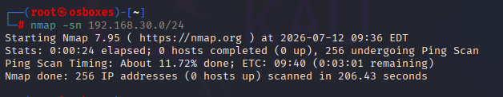
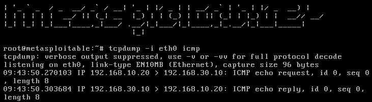
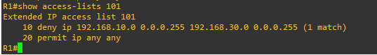

## Objective

Bypass VLAN segmentation between VLAN 10 (ATTACKER) and VLAN 30 (SERVERS) — which 
was explicitly blocked via an inbound ACL on the router — using a VLAN hopping 
technique known as double-tagging (802.1Q double encapsulation).

## Attack Mechanism

Double-tagging exploits how trunk links handle native VLAN traffic. An attacker 
crafts a frame with two stacked 802.1Q tags: an outer tag matching the trunk's 
native VLAN, and an inner tag matching the target VLAN. Because native VLAN 
traffic is expected to be untagged on the wire, the first switch strips the outer 
tag as the frame crosses the trunk — leaving only the inner tag, which the next 
device (switch or router) reads as the frame's real VLAN membership. This is a 
one-way, blind attack: it doesn't establish a return path, since there's no 
equivalent stripping mechanism for a response.

[More on VLAN hopping/double-tagging →](https://www.imperva.com/learn/availability/vlan-hopping/)

## Recon

An initial ACL was applied to block VLAN 10 → VLAN 30 traffic (see [topology 
README](../topology/README.md) for details). A follow-up nmap scan confirmed the 
block was effective:
```

nmap -sn 192.168.30.0/24

```



Result: 0 hosts detected, confirming VLAN 10 has no visibility into VLAN 30 
under normal conditions.

## Exploitation

To execute the double-tagging attack, a custom Python script was written using 
the `scapy` library to craft a raw, double-tagged Ethernet frame — no existing 
tool performs this exact frame construction, making it a good candidate for a 
first custom security tool.

**`doubleQ.py`:**
```python
#!/usr/bin/env python3

from scapy.all import *

packet = (Ether() / Dot1Q(vlan=1) / Dot1Q(vlan=30) / IP(dst="192.168.30.10") / ICMP())

sendp(packet, iface="eth0")
```

The script constructs a frame with two stacked 802.1Q tags — an outer tag 
matching the trunk's native VLAN (1), and an inner tag matching the target VLAN 
(30) — carrying a single ICMP echo request destined for Metasploitable.

**Result:** the crafted frame successfully reached Metasploitable (192.168.30.10), 
confirmed via `tcpdump` on the target — despite the ACL on R1's f0/0.10 
explicitly blocking VLAN 10 → VLAN 30 traffic. Metasploitable also sent an ICMP 
echo reply back to Kali. This does *not* indicate double-tagging is bidirectional 
— it simply reflects that no ACL exists restricting VLAN 30 → VLAN 10 traffic, so 
the reply traveled back via a completely separate, unrestricted path.



## Impact

While this proof-of-concept used a simple ICMP packet to demonstrate the bypass, 
double-tagging can deliver any single crafted frame past VLAN segmentation — 
making it a delivery mechanism for other blind, one-way attacks rather than an 
attack in itself. The most realistic and effective payload is ARP spoofing: an 
attacker sends a frame with a forged ARP reply claiming a chosen IP address maps 
to their own MAC address. Since most operating systems passively trust unsolicited 
ARP replies, the target updates its ARP cache with false information — for 
example, an attacker could claim to be the network's own router, redirecting 
traffic through their machine and enabling man-in-the-middle interception.


## Remediation

### Attempted Fix #1 — Native VLAN Tagging

The textbook fix for double-tagging is `vlan dot1q tag native`, which forces all 
native VLAN traffic on a trunk to be explicitly tagged rather than sent untagged. 
Since the attack relies on the switch treating native VLAN traffic as "safe to 
send untagged" (stripping the outer tag as part of that assumption), forcing 
explicit tagging should remove the ambiguity that makes stripping happen at all.

**Result: this fix did not stop the attack.** ICMP traffic still reached 
Metasploitable after this change was applied and verified (`show vlan dot1q tag 
native` confirmed enabled, config saved).

### Investigation

Packet captures at each stage of the frame's path revealed the outer tag was 
still being stripped somewhere between Kali and R1, despite native VLAN tagging 
being enforced — behavior that contradicts documented Cisco switch behavior for 
this exact command. `show version` on IOU1 confirmed the switch image in use is 
an `EARLY DEPLOYMENT DEVELOPMENT BUILD` — a pre-release IOU image, not a 
production Cisco IOS build. This is the most likely explanation for the 
discrepancy: emulated/development-build switch images may not fully replicate 
production ASIC-level tag-handling behavior, even when configured identically.

Regardless of the exact cause, the underlying issue was clear: R1 trusts a 
frame's VLAN tag at face value, with no way to verify it against the frame's 
true physical origin. A spoofed frame tagged VLAN 30 arrives **inbound on R1's 
f0/0.30 sub-interface** — with no ACL guarding that entry point — and is then 
routed locally within VLAN 30 to reach Metasploitable, which sits on the same 
directly-connected segment.

### Attempted Fix #2 — Destination-Side ACL (Successful)

Since the tag-based bypass could not be reliably closed at the switching layer, 
the fix was moved to a checkpoint the attack cannot avoid: Layer 3 forwarding. 
Regardless of which sub-interface a spoofed frame is associated with on arrival, 
R1 must still forward it toward its true destination IP — and any traffic 
reaching Metasploitable has to pass **outbound through f0/0.30** to get there, 
even if it arrived on that same sub-interface.

A second ACL (101) was applied outbound on f0/0.30, denying traffic sourced 
from 192.168.10.0/24:

```
access-list 101 deny ip 192.168.10.0 0.0.0.255 192.168.30.0 0.0.0.255
access-list 101 permit ip any any
interface f0/0.30
ip access-group 101 out
```
This catches the packet based on its unspoofable source/destination IP pair, 
at the one processing point the attack cannot route around — regardless of 
which VLAN tag trickery got it there.

## Re-verification

The exact same attack (`doubleQ.py`) was re-run after applying ACL 101.

**Result:** no ICMP traffic was observed on Metasploitable's interface (`tcpdump -i 
eth0 icmp` showed nothing), and `show access-lists 101` on R1 confirmed a match on 
the deny rule — proving the packet was received and actively dropped, not simply 
lost or misrouted.

```
access-list 101 deny ip 192.168.10.0 0.0.0.255 192.168.30.0 0.0.0.255 (1 match)
access-list 101 permit ip any any

```




The bypass is closed. VLAN 10 can no longer reach VLAN 30 via double-tagging, 
even though the underlying tag-spoofing behavior on this switch image remains 
unresolved — the fix holds at the routing layer regardless.


## Lessons Learned

Going in, I expected a clean pipeline: learn the theory, apply it, harden, verify. 
The reality was messier and more valuable. Learning scapy meant building and 
debugging a script from scratch with no prior tool-building experience. Getting 
the attack working brought real excitement — followed immediately by confusion 
when the textbook remediation didn't work as documented. That forced a proper 
investigation: packet captures at every stage, cross-checking sources, and 
eventually discovering the tool environment itself (a pre-release IOU image) was 
likely behind the discrepancy — something no amount of re-reading theory would 
have revealed. 

The real lesson wasn't about VLAN hopping specifically — it was about how to 
actually debug a security problem: don't trust a single explanation, verify with 
evidence at each stage, and know when to stop chasing a root cause and instead 
patch the actual risk at a point you can control. When the underlying platform 
quirk turned out to be effectively unfixable within the lab's constraints, the 
right move was hardening at a different layer (Layer 3 routing) rather than 
continuing to chase an unresolvable Layer 2 mystery.
