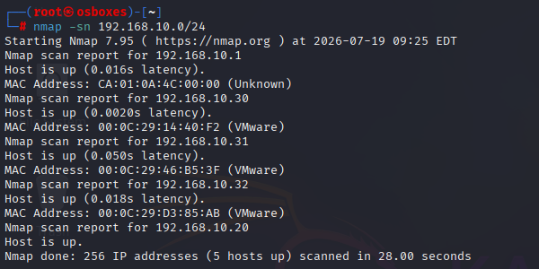
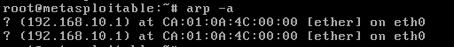
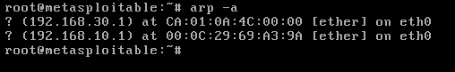
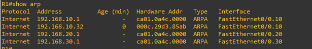
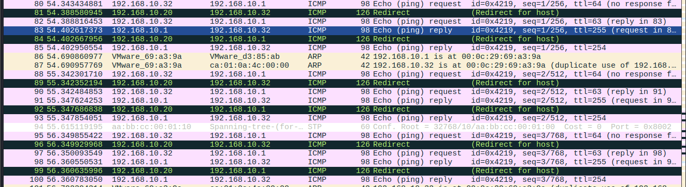
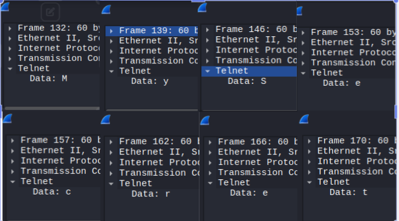

## Objective

Exploit ARP's lack of authentication to perform a bidirectional man-in-the-middle 
attack between two hosts on the same VLAN — poisoning both parties' ARP caches to 
route their traffic through the attacker, then intercepting unencrypted traffic 
(Telnet credentials) as a real-world demonstration of impact.

## Attack Mechanism

ARP has no built-in authentication — any device on a broadcast domain can send an 
ARP reply claiming ownership of any IP address, and most operating systems will 
trust it. This attack requires the attacker and both targets to share the same 
VLAN/broadcast domain, since ARP does not route across subnets.

The attacker sends unsolicited ("gratuitous") ARP replies to each target, falsely 
claiming that the other target's IP address maps to the attacker's own MAC 
address. During testing, it was discovered that a gratuitous ARP reply is only 
accepted if the target **already has an existing cache entry** for the claimed 
IP — if no prior entry exists, the reply is silently dropped rather than creating 
a new one. This held true across three different target operating systems 
tested (see Recon/PoC below).

Once both targets' caches are poisoned — each now sending traffic intended for 
the other directly to the attacker's MAC — the attacker enables IP forwarding, 
allowing it to transparently relay traffic between the two victims. Neither 
victim can tell their traffic is being routed through a third party, since 
connectivity between them continues to function normally.

[More on ARP spoofing →](https://www.imperva.com/learn/application-security/arp-spoofing/)

## Recon

An `nmap -sn 192.168.10.0/24` scan from Kali discovered the live hosts sharing 
the attacker's broadcast domain:



Pinging each discovered host from Kali populated Kali's own ARP cache, revealing 
their real MAC addresses — a necessary step before crafting any forged ARP 
reply, since the attacker needs the victim's real MAC to actually deliver the 
forged frame.

## Exploitation (PoC)

To establish a baseline before attempting a full MITM, a unidirectional test was 
performed first — proving a target's ARP cache could actually be poisoned via a 
single crafted, unsolicited ARP reply.

**`poisonArp.py`:**
```python
#!/usr/bin/env python3
from scapy.all import *
arp_reply = (Ether(dst="00:0c:29:d3:85:ab") / ARP(op=2, psrc="192.168.10.1", 
             hwsrc="00:0c:29:69:a3:9a", pdst="192.168.10.32", 
             hwdst="00:0c:29:d3:85:ab"))
sendp(arp_reply, iface="eth0")
```

Run once against Metasploitable2 (192.168.10.32), this script sends a single 
forged reply claiming R1's IP (192.168.10.1) belongs to Kali's MAC address.

**Result:** the poisoned entry appeared successfully — but only once 
Metasploitable2 already had a genuine, prior entry for 192.168.10.1 to overwrite 
(see Attack Mechanism above for why gratuitous ARP alone failed to create a new 
entry from scratch across three tested OSes). Additionally, since this was a 
single reply rather than a loop, the poisoned entry naturally decayed and 
reverted once the victim's cache timeout expired — motivating the looped 
approach used in the full attack below.

**Before** (legitimate entry, R1's real MAC):



**After** (poisoned entry, Kali's MAC):



## Exploitation (Full Attack)

> **Setup note:** to provide a realistic unencrypted service to demonstrate 
> credential interception, R1's VTY lines were configured with Telnet access 
> and a simple password (`line vty 0 4` / `password MySecret` / `login`).

The single-shot PoC proved the mechanism but decayed too quickly...

The single-shot PoC proved the mechanism but decayed too quickly for a sustained 
MITM position. Two looped scripts were built — one continuously re-poisoning 
each target every 2 seconds, keeping the forged entries in place indefinitely.

**`poison-meta.py`** (poisons Metasploitable2 — claims R1's IP is at Kali's MAC):
```python
#!/usr/bin/env python3
import time
from scapy.all import *
arp_reply = (Ether(dst="00:0c:29:d3:85:ab") / ARP(op=2, psrc="192.168.10.1", 
             hwsrc="00:0c:29:69:a3:9a", pdst="192.168.10.32", 
             hwdst="00:0c:29:d3:85:ab"))
while True:
    sendp(arp_reply, iface="eth0")
    time.sleep(2)
```

**`poison-r1.py`** (poisons R1 — claims Metasploitable2's IP is at Kali's MAC):
```python
#!/usr/bin/env python3
import time
from scapy.all import *
arp_reply = (Ether(dst="ca:01:0a:4c:00:00") / ARP(op=2, psrc="192.168.10.32", 
             hwsrc="00:0c:29:69:a3:9a", pdst="192.168.10.1", 
             hwdst="ca:01:0a:4c:00:00"))
while True:
    sendp(arp_reply, iface="eth0")
    time.sleep(2)
```

Both scripts were run simultaneously in separate terminals, poisoning 
Metasploitable2 (thinks Kali is R1) and R1 (thinks Kali is Metasploitable2) at 
the same time and holding both entries in place continuously.



With both caches poisoned, IP forwarding was enabled on Kali 
(`sysctl -w net.ipv4.ip_forward=1`), positioning Kali as a transparent relay. 
Metasploitable2 sent an ICMP echo request to R1 — the ping succeeded normally, 
while Kali's capture confirmed the traffic was passing directly through it in 
both directions:



To demonstrate real-world impact beyond simple traffic relay, Metasploitable2 
then opened a Telnet session to R1. Since Telnet transmits every character 
unencrypted, Kali's capture showed the login password in plaintext, one 
keystroke at a time:



## Impact

Beyond capturing a single set of Telnet credentials, a MITM position achieved 
through ARP spoofing enables far more damaging attacks: session hijacking 
(taking over an already-authenticated session), packet injection (altering 
traffic in transit before forwarding it — for example, intercepting a DNS query 
and returning a forged response to redirect a victim to an attacker-controlled 
site instead of the real one), and broader traffic manipulation across any 
protocol crossing the poisoned link, not just Telnet.

This attack is also more dangerous specifically because it's internal. External, 
perimeter-facing traffic is commonly encrypted by default, but internal LAN 
traffic is frequently assumed "safe" simply because it never leaves the local 
network — an assumption ARP spoofing directly breaks, since the attacker only 
needs a foothold on the same VLAN, not any access to the wider internet path. 
On a real internal network, this could mean intercepted credentials, altered or 
leaked sensitive data, and a foothold for further attacks such as ransomware 
deployment.
