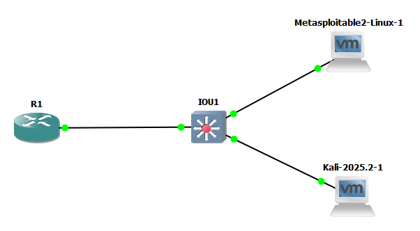

# Topology Overview

## Network Design

The lab uses a segmented topology built around Router-on-a-Stick inter-VLAN routing, 
with a single Layer 2 switch handling VLAN separation and trunking.

- **1x Router** — performs inter-VLAN routing via sub-interfaces (Router-on-a-Stick)
- **1x Layer 2 Switch** — VLAN-aware, 802.1Q trunking configured to the router

## VLAN Segmentation

| VLAN ID | Name     | Subnet          | Gateway        | Connected Host(s)  |
|---------|----------|-----------------|-----------------|---------------------|
| 10      | ATTACKER | 192.168.10.0/24 | 192.168.10.1   | Kali Linux          |
| 20      | INTERNAL | 192.168.20.0/24 | 192.168.20.1   | *(unassigned)*       |
| 30      | SERVERS  | 192.168.30.0/24 | 192.168.30.1   | Metasploitable 2     |

## Current Security Posture

## Current Security Posture

An initial connectivity test (`nmap -sn 192.168.30.0/24` from Kali) revealed that, 
despite VLAN segmentation, inter-VLAN routing allowed full, unrestricted 
communication between all three VLANs. This did not reflect a realistic security 
posture, so a baseline ACL was applied before any attack testing began.

**Applied ACL:** denies traffic sourced from VLAN 10 (ATTACKER) destined for VLAN 30 
(SERVERS), applied inbound on R1's f0/0.10 sub-interface. All other traffic is 
permitted.

**Effective behavior:** the ACL only inspects traffic entering R1 from VLAN 10. This 
means VLAN 30 can technically *initiate* a connection toward VLAN 10 (the request 
isn't blocked), but any reply traffic — sourced from VLAN 10, destined for VLAN 30 
— is silently dropped on re-entry through f0/0.10. In practice, this makes any 
VLAN30↔VLAN10 connection non-functional, despite the block being one-directional 
by design.

access-list 100 deny ip 192.168.10.0 0.0.0.255 192.168.30.0 0.0.0.255
access-list 100 permit ip any any
interface f0/0.10
ip access-group 100 in

**Verification:** post-ACL, the same nmap scan against 192.168.30.0/24 from Kali 
returned 0 hosts up (200+ second timeout), confirming the block is effective.
